<div align="center">

<h1>litellm-langfuse-caddy</h1>

<p><strong>Local AI gateway with full observability</strong></p>

<p>Route all your LLM traffic through a single proxy with automatic tracing,<br>per-tool attribution, and session evaluation.</p>

<p>
  
  
  
  
</p>

<p>
  <a href="#quick-start">Quick Start</a> ·
  <a href="#features">Features</a> ·
  <a href="#architecture">Architecture</a> ·
  <a href="#provider-setup">Providers</a> ·
  <a href="#maintenance">Maintenance</a>
</p>

</div>

<br>

## Quick Start

```bash
git clone https://github.com/aaronmorris-dev/litellm-langfuse-caddy.git
cd litellm-langfuse-caddy

cp .env.example .env
cp litellm/config.example.yaml litellm/config.yaml

# Generate secrets and edit .env:
openssl rand -hex 32   # → SALT, ENCRYPTION_KEY, NEXTAUTH_SECRET
openssl rand -hex 16   # → LITELLM_MASTER_KEY

# Uncomment your providers in litellm/config.yaml, then:
chmod +x scripts/*.sh
./scripts/start.sh
```

<table>
  <tr>
    <td><strong>LiteLLM Proxy</strong></td>
    <td><a href="http://localhost:4000">localhost:4000</a></td>
  </tr>
  <tr>
    <td><strong>LiteLLM Admin</strong></td>
    <td><a href="http://localhost:4000/ui">localhost:4000/ui</a></td>
  </tr>
  <tr>
    <td><strong>Langfuse</strong></td>
    <td><a href="http://localhost:5002">localhost:5002</a></td>
  </tr>
  <tr>
    <td><strong>MinIO Console</strong></td>
    <td><a href="http://localhost:9091">localhost:9091</a></td>
  </tr>
</table>

<br>

## First-Time Setup

After `./scripts/start.sh` completes:

<table>
  <tr>
    <td><strong>1</strong></td>
    <td>Go to <a href="http://localhost:5002">localhost:5002</a> — sign up, create an org and project</td>
  </tr>
  <tr>
    <td><strong>2</strong></td>
    <td>Settings → API Keys → Create. Copy <code>pk-lf-...</code> and <code>sk-lf-...</code> into <code>.env</code></td>
  </tr>
  <tr>
    <td><strong>3</strong></td>
    <td>Run <code>docker compose up -d</code> to pick up the new keys</td>
  </tr>
  <tr>
    <td><strong>4</strong></td>
    <td>Go to <a href="http://localhost:4000/ui">localhost:4000/ui</a> → Virtual Keys → create per-tool keys with descriptive aliases</td>
  </tr>
</table>

<br>

## Features

<table>
  <tr>
    <td width="50%" valign="top">
      <h3>🔀 Multi-Provider Routing</h3>
      <p>AWS Bedrock, Google Vertex AI, Gemini API, OpenAI, Anthropic — all behind one OpenAI-compatible endpoint. Switch models without changing client code.</p>
    </td>
    <td width="50%" valign="top">
      <h3>🏷️ Per-Tool Virtual Keys</h3>
      <p>Create a LiteLLM virtual key per tool (Claude Code, Gemini CLI, Codex, etc.). Every request is automatically attributed to the originating tool in Langfuse.</p>
    </td>
  </tr>
  <tr>
    <td width="50%" valign="top">
      <h3>🪄 Zero-Config Trace Enrichment</h3>
      <p><code>langfuse_enrich.py</code> runs as a LiteLLM pre-call hook. It maps virtual key metadata → Langfuse trace names, daily sessions, and tags. No client-side headers needed.</p>
    </td>
    <td width="50%" valign="top">
      <h3>📊 Session Evaluation</h3>
      <p>LLM-as-judge script evaluates entire sessions on task completion, approach quality, and communication. Scores are posted back to Langfuse for analytics.</p>
    </td>
  </tr>
  <tr>
    <td width="50%" valign="top">
      <h3>⚡ SSE Streaming Optimized</h3>
      <p>Caddy reverse proxy configured with <code>flush_interval -1</code> and 600s response timeouts. Zero buffering delay on streaming LLM responses.</p>
    </td>
    <td width="50%" valign="top">
      <h3>🔒 Production Hardened</h3>
      <p>Memory limits, <code>no-new-privileges</code>, log rotation, graceful shutdown, health checks on every service. UTC timezone enforced on all data stores.</p>
    </td>
  </tr>
</table>

<br>

## Architecture

```mermaid
flowchart TD
    CLI["🖥️ CLI Tools\nClaude Code · Gemini CLI · OpenAI SDK"]

    CLI -->|":4000 · :5002"| Caddy

    subgraph compose[" Docker Compose Stack "]
        Caddy["🔀 Caddy\nReverse Proxy · SSE"]

        Caddy --> LiteLLM["⚙️ LiteLLM\nUnified LLM Proxy"]
        Caddy --> Langfuse["📊 Langfuse\nObservability"]

        LiteLLM -.->|"OTEL traces"| Langfuse
        Worker["⚙️ Langfuse Worker"]

        LiteLLM --> PG & Redis
        Langfuse & Worker --> PG & CH & Redis & MinIO

        PG[("PostgreSQL 17")]
        CH[("ClickHouse 26")]
        Redis[("Redis 7.4")]
        MinIO[("MinIO")]
        PG ~~~ CH ~~~ Redis ~~~ MinIO
    end

    LiteLLM --> Providers["☁️ Bedrock · Vertex AI · Gemini · OpenAI · Anthropic"]
```



<br>

## What's In The Stack

<table>
  <thead>
    <tr>
      <th>Service</th>
      <th>Image</th>
      <th>Purpose</th>
      <th>Exposed Port</th>
    </tr>
  </thead>
  <tbody>
    <tr>
      <td><strong>Caddy</strong></td>
      <td><code>caddy:2-alpine</code></td>
      <td>Reverse proxy with SSE streaming, JSON logging, graceful shutdown</td>
      <td><code>:4000</code> <code>:5002</code></td>
    </tr>
    <tr>
      <td><strong>LiteLLM</strong></td>
      <td><code>ghcr.io/berriai/litellm:main-v1.81.14-stable</code></td>
      <td>Unified LLM proxy — routes to any provider via OpenAI-compatible API</td>
      <td>—</td>
    </tr>
    <tr>
      <td><strong>Langfuse</strong></td>
      <td><code>langfuse/langfuse:3</code></td>
      <td>Observability dashboard — traces, sessions, scores, analytics</td>
      <td>—</td>
    </tr>
    <tr>
      <td><strong>Langfuse Worker</strong></td>
      <td><code>langfuse/langfuse-worker:3</code></td>
      <td>Background trace ingestion and processing</td>
      <td>—</td>
    </tr>
    <tr>
      <td><strong>PostgreSQL</strong></td>
      <td><code>postgres:17-alpine</code></td>
      <td>Metadata storage for LiteLLM (keys, spend) and Langfuse (projects, users)</td>
      <td>—</td>
    </tr>
    <tr>
      <td><strong>ClickHouse</strong></td>
      <td><code>clickhouse/clickhouse-server:26.2</code></td>
      <td>High-performance columnar storage for Langfuse traces and observations</td>
      <td>—</td>
    </tr>
    <tr>
      <td><strong>Redis</strong></td>
      <td><code>redis:7.4-alpine</code></td>
      <td>LiteLLM response cache (1h TTL) + Langfuse background job queue</td>
      <td>—</td>
    </tr>
    <tr>
      <td><strong>MinIO</strong></td>
      <td><code>cgr.dev/chainguard/minio</code></td>
      <td>S3-compatible object store for Langfuse event and media uploads</td>
      <td><code>:9090</code> <code>:9091</code></td>
    </tr>
  </tbody>
</table>

<br>

## Provider Setup

<details>
<summary><strong>AWS Bedrock</strong> — Claude via AWS SSO</summary>
<br>

```bash
# 1. Configure SSO profile
aws configure sso --profile your-profile-name

# 2. Login
aws sso login --profile your-profile-name
```

Add to `.env`:

```
AWS_PROFILE=your-profile-name
```

Uncomment in `docker-compose.yaml` under litellm volumes:

```yaml
- ~/.aws:/root/.aws # writable — SSO needs token cache
```

Uncomment models in `litellm/config.yaml`:

```yaml
- model_name: claude-sonnet-4-6
  litellm_params:
    model: bedrock/us.anthropic.claude-sonnet-4-6
```

> **Note**: The `~/.aws` mount must NOT be `:ro` — AWS SSO writes token cache files during credential refresh.

</details>

<details>
<summary><strong>Google Vertex AI</strong> — Gemini via Application Default Credentials</summary>
<br>

```bash
gcloud auth application-default login
```

Add to `.env`:

```
GOOGLE_APPLICATION_CREDENTIALS=/root/.config/gcloud/application_default_credentials.json
```

Uncomment in `docker-compose.yaml` under litellm volumes:

```yaml
- ~/.config/gcloud:/root/.config/gcloud:ro
```

Add models to `litellm/config.yaml`:

```yaml
- model_name: gemini-2.5-flash
  litellm_params:
    model: vertex_ai/gemini-2.5-flash
    vertex_project: your-gcp-project
    vertex_location: us-central1
```

</details>

<details>
<summary><strong>Gemini API</strong> — Key-based (no GCP project needed)</summary>
<br>

Get a key from [Google AI Studio](https://aistudio.google.com/apikey), then add to `.env`:

```
GEMINI_API_KEY=your-key
```

Add to `litellm/config.yaml`:

```yaml
- model_name: gemini-2.5-flash
  litellm_params:
    model: gemini/gemini-2.5-flash
```

</details>

<details>
<summary><strong>OpenAI / Anthropic</strong> — Direct API keys</summary>
<br>

Add the env var to the litellm service in `docker-compose.yaml`:

```yaml
- OPENAI_API_KEY=${OPENAI_API_KEY}
# or
- ANTHROPIC_API_KEY=${ANTHROPIC_API_KEY}
```

Add to `litellm/config.yaml`:

```yaml
- model_name: gpt-4o
  litellm_params:
    model: openai/gpt-4o

- model_name: claude-sonnet-4-6
  litellm_params:
    model: anthropic/claude-sonnet-4-6
```

</details>

<br>

## Using the Gateway

### Route CLI tools through the proxy

```bash
source scripts/gateway-env.sh

# Now any OpenAI/Anthropic SDK-compatible tool routes through LiteLLM:
# ANTHROPIC_BASE_URL=http://localhost:4000
# OPENAI_BASE_URL=http://localhost:4000/v1
```

### How trace enrichment works

```
┌─────────────────────────────────────────────────────────────────┐
│  Virtual Key: alias="claude", tags=["claude"], user_id="alice" │
└──────────────────────────┬──────────────────────────────────────┘
                           │
                           ▼
              ┌─────────────────────────┐
              │   langfuse_enrich.py    │
              │   (LiteLLM pre-call)    │
              └─────────────────────────┘
                           │
              ┌────────────┼────────────┐
              ▼            ▼            ▼
        trace_name    session_id      tags
        "claude"    "claude-2026-03-14" ["claude"]
```

Create virtual keys in [LiteLLM Admin](http://localhost:4000/ui) with:

| Field     | Example                | Langfuse Result          |
| --------- | ---------------------- | ------------------------ |
| Key Alias | `claude`               | Trace name: `claude`     |
| User ID   | `alice`                | Trace userId: `alice`    |
| Metadata  | `{"tags": ["claude"]}` | Trace tags: `["claude"]` |

The enrichment hook auto-generates **daily sessions** (`claude-2026-03-14`) grouping all traces from the same tool on the same day. Clients can override with a `langfuse_session_id` header.

<br>

## Maintenance

<details>
<summary><strong>Prune old data</strong></summary>
<br>

```bash
# Deletes: spend logs (30d), error logs (14d), traces (30d), scores (60d)
./scripts/prune-postgres.sh
```

This cleans both PostgreSQL (LiteLLM spend/error logs) and ClickHouse (Langfuse traces/observations).

</details>

<details>
<summary><strong>Evaluate a session</strong></summary>
<br>

Uses LLM-as-judge to score sessions on 4 dimensions (0.0–1.0), then posts scores back to Langfuse.

```bash
# Requires: uv (https://docs.astral.sh/uv/)
uv run --script scripts/eval-session.py --today claude
uv run --script scripts/eval-session.py claude-2026-03-14
uv run --script scripts/eval-session.py claude-2026-03-14 --dry-run --verbose
```

| Dimension          | Weight | What it measures                             |
| ------------------ | ------ | -------------------------------------------- |
| `task_completion`  | 50%    | Did the assistant complete the user's goals? |
| `approach_quality` | 30%    | Engineering soundness and efficiency         |
| `communication`    | 20%    | Clarity, concision, appropriateness          |
| `overall`          | —      | Weighted composite of the above              |

</details>

<details>
<summary><strong>Check provider credentials</strong></summary>
<br>

```bash
./scripts/refresh-credentials.sh
```

Checks AWS SSO session and GCloud ADC token, refreshing expired credentials interactively.

</details>

<details>
<summary><strong>Stop / restart / logs</strong></summary>
<br>

```bash
docker compose down        # Stop all services
docker compose up -d       # Start all services
docker compose logs -f     # Follow all logs
docker compose ps          # Check service status
```

</details>

<br>

## Hardening Details

Every service in the stack is configured with defense-in-depth:

| Control               | Applied To                                        | Detail                                                    |
| --------------------- | ------------------------------------------------- | --------------------------------------------------------- |
| `mem_limit`           | All 8 services                                    | Prevents runaway memory (128m–1536m per service)          |
| `no-new-privileges`   | All 8 services                                    | Blocks privilege escalation inside containers             |
| `read_only: true`     | Caddy                                             | Immutable root filesystem with tmpfs for runtime data     |
| `init: true`          | LiteLLM, Langfuse, Worker, MinIO                  | Proper PID 1 signal handling via tini                     |
| `TZ=UTC` / `PGTZ=UTC` | PostgreSQL, ClickHouse                            | Prevents timezone-related query failures                  |
| Log rotation          | All 8 services                                    | json-file driver with 5–20MB max-size, 3–5 file retention |
| Health checks         | 6 of 8 services                                   | HTTP/TCP probes with start_period, retries, and intervals |
| `stop_grace_period`   | LiteLLM (30s), Langfuse (15s), PG (30s), CH (15s) | Clean shutdown for stateful services                      |
| `127.0.0.1` binding   | Caddy, MinIO                                      | Ports only accessible from localhost                      |

<br>

## Prerequisites

- [OrbStack](https://orbstack.dev/) (recommended) — lightweight Docker runtime for macOS with lower memory overhead, faster container starts, and native Rosetta x86 emulation. Any Docker-compatible runtime works, but OrbStack is ideal for this 8-service stack.
- ~4 GB RAM available for containers
- Credentials for at least one LLM provider

<br>

## File Structure

```
.
├── docker-compose.yaml          # 8-service stack definition
├── Caddyfile                    # Reverse proxy config (SSE, timeouts, logging)
├── .env.example                 # All required environment variables
├── litellm/
│   ├── config.example.yaml      # LiteLLM model config template
│   └── langfuse_enrich.py       # Trace enrichment hook (auto-loaded by LiteLLM)
└── scripts/
    ├── start.sh                 # Startup with validation
    ├── gateway-env.sh           # Source to route tools through the proxy
    ├── refresh-credentials.sh   # Check/refresh provider credentials
    ├── prune-postgres.sh        # Data retention maintenance
    ├── prune-postgres.sql       # PostgreSQL pruning policy
    └── eval-session.py          # LLM-as-judge session evaluation
```

<br>

<div align="center">
  <sub>MIT License · Built for developers who want observability without the overhead.</sub>
</div>
